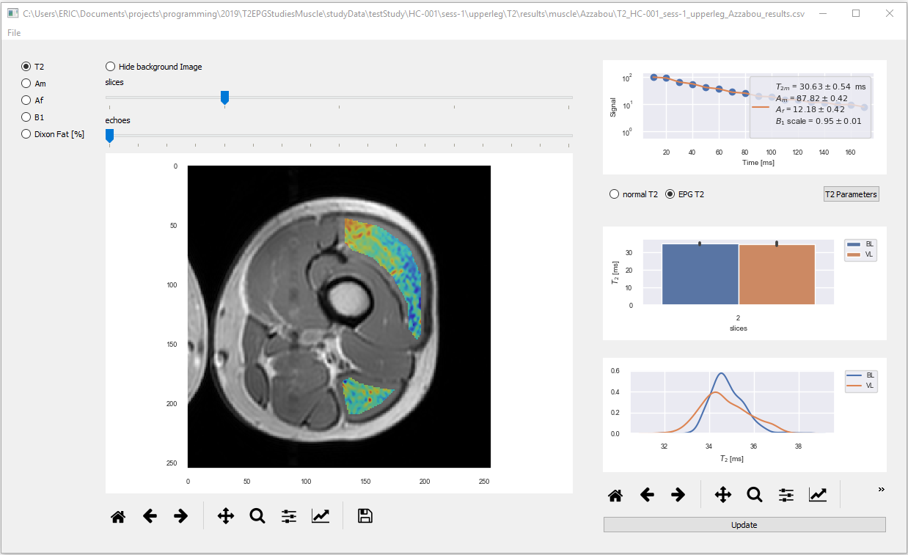

# T2EPGviewer
pyQT Dashboard display of MRI T2 EPG muscle data

### Running the main program

```
  python simple_pandas_plot.py
```



This progam summarizes the fitting of muscle MRI T2 data. 

It reads in data from a study directory structure that was created from the project https://github.com/EricHughesABC/T2EPGStudiesMuscle

Example data is provided in the study data directory testStudy.

Below is a screenshot of the fileopen dialog showing the data file required to be read in.


### Requirements

The program has been tested on python 3.7

In order for the EPG fitting to work the following module has to be installed

https://github.com/EricHughesABC/epg

- pyQT5
- pandas
- seaborn
- matplotlib
- lmfit
- pydicom

